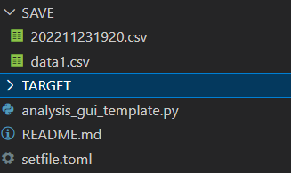

# LabVIEWとPythonの連携

### はじめに
LabVIEWのサブスクリプト移行により、計測部分はこれまで使ってきたLabVIEWで、解析の部分だけをPythonで行えないか？との相談を受けた。（そうすると一番安いLabVIEWのサブスク費用でまかなえる。解析モジュールを使わないですむ。）相談では、リアルタイム処理（数msオーダーの処理）は不要とのことでした。そこでいくつかの解決策が考えられます。

- LabVIEWからPythonを呼び出して処理
LabVIEWにある（1）Pythonノード、（2）コマンドプロンプト、（3）HTTPクライアントなどを利用してPythonとの連携が考えられます。（1）のPythonノードは使ったことがないのでわかりませんが、[LabVIEWでPythonコードを活用する ](https://marblerule.com/how-to-use-python-node/)の解説を見ると制約が多い印象を受けます。（2）コマンドプロンプトの場合、Python側では sys.argvを使って引数を渡すようにプログラムする必要があります。（3）HTTPの場合、Python側でFLASKやFastAPIなどでWebアプリを作る必要があります。
これらの方法を利用するには、そこそこのLabVIEWとPythonの両方の知識が必要になります。

コマンドプロンプトを使った参考記事はこちら（2017年の記事）。

[LabVIEWとPythonでQRコードを作る ](https://forums.ni.com/t5/NI%E8%A3%BD%E5%93%81%E3%83%87%E3%82%A3%E3%82%B9%E3%82%AB%E3%83%83%E3%82%B7%E3%83%A7%E3%83%B3/LabVIEW%E3%81%A8Python%E3%81%A7QR%E3%82%B3%E3%83%BC%E3%83%89%E3%82%92%E4%BD%9C%E3%82%8B/m-p/3592327)

- ファイルで渡す
古典的な方法ですが、ファイルでの受け渡しが一番簡単です。この場合、ファイルの受け渡しルールだけを決めれば、それぞれの言語に精通している人で個別に作ることができます。

例えば、
LabVIEW側でフォルダーに計測データをセーブ（例えば、ヘッダー付きCSV）して、Pythonで処理したデータを別のファイルに保存（こちらもヘッダー付きCSV）して、LabVIEW側でそのファイルを読み込む方法が考えられます。ある決められたフォルダーを監視して、ファイルがあれば処理して、他のフォルダーに処理した結果とTargetにあるファイルを移動します（解析デーモン）。

このプログラム例を参考までに示します。

### 解析監視GUI （解析デーモン）
Target Folder（処理するファイルが入るフォルダー）とSave Folder（処理したファイルの保存と、Targetに入っていたファイルを移すフォルダー）を用意します。
Target Folderを巡回監視して、ファイルがあれば処理して、Save Folderに処理した結果とTargetにあるファイルを移動します。PysimpleguiでGUIをつけています。（Pythonが入っていないPCにはPyInstallerなどでExe化して配布します。）


解析監視GUI 作成

Target Folder: 処理するファイルが入るフォルダー

Save Folder: Targetに入っていたファイルを移すフォルダーとグラフ画像

装置によってFile Typeが異なるので、Type1 とType2のどちらかを選ぶ

Loop startでTargetFolderの監視開始

Loop Stopで監視停止

Cancelでプログラム終了


Target Folderに data1.csvファイルが入っています。Loop startを押すとそのファイルが処理されて、Save Folderに移されます。


Cancelを押すとプログラムは終了して結果をまとめたCSVファイルが作成されます。

なおLoop stopは監視を止めます。Loop startで再開できます。




```python
"""
Targetフォルダーに解析対象ファイルがある場合、解析を行う
解析対象ファイルをSaveフォルダーに移動する
解析結果の画像、解析のまとめCSVファイルを作成してSaveフォルダーに格納

解析対象ファイルのフォーマットが異なる(例えば、xyの並びが異なる、ヘッダーがないなど）場合でも選べる様にする

初期設定ファイル（Toml形式）でTarget,Saveフォルダーをあらかじめ指定する。

"""

from pathlib import Path
import shutil
import time
import toml
import pandas as pd
import numpy as np
import PySimpleGUI as sg


# ---　ファイルを解析するクラス　（別ファイルに作成してもよい）
import datetime

def now_datetime(type=1):
    """
    日時を文字列で返す
    type1:通常表示 "%Y-%m-%d %H:%M:%S"
    type2:"%Y%m%d%H%M%S"
    type3:"%Y%m%d_%H%M%S"
    type4:Base_file_nameで使用する形式 "%Y%m%d%H%M"
    elae:日付のみ "%Y%m%d"
    :return:
    """
    now = datetime.datetime.now()
    if type == 1:
        now_string = now.strftime("%Y-%m-%d %H:%M:%S")
    elif type == 2:
        now_string = now.strftime("%Y%m%d%H%M%S")
    elif type == 3:
        now_string = now.strftime("%Y%m%d_%H%M%S")
    elif type == 4:
        now_string = now.strftime("%Y%m%d%H%M")
    elif type == 5:
        now_string = now.strftime("%m%d_%H:%M:%S")
    elif type == 6:
        now_string = now.strftime("%Y%m%d")    
    else:
        now_string = now

    return  now_string

class Analysis():
    """
    example:
        fname = r'./TARGET/data1.csv'
        test = Analysis(fname)
        test.read_file()
        test.estimate()
        print(test.meta)

    """
    
    def __init__(self,file):
        self.file = Path(file)
        
    def read_file(self):
        
        #Pandasのcsv読み込みを例に
        self.df = pd.read_csv(self.file)
        
    def estimate(self):
        # 解析結果を辞書型に格納 
        total =  np.sum(self.df.iloc[:,1]*2) # Intensityを2倍にして和を計算
        
        self.meta = {'file_name':self.file.stem,'data':total}     

# Analysis Classを継承しています。異なる動作をさせたいメソッドのみ記述
class AnalysisB(Analysis):
    
    def read_files(self):
        pass
        # with open(self.file) as f:
        #     s = f.read()
        # self.data = s 
 
       
# ------ ここからGUIプログラム

sg.theme('Light Blue 2')

#　設定ファイルをTOMLで用意している場合
try: 
    with open('./setfile.toml') as f:
        set_obj = toml.load(f)
except: #tomlファイルがない場合
    set_obj = {"target_folder":'',"save_folder":'','file_type':'type1'}
    

layout = [[sg.Text('Auto Analysis')],
            [sg.Text("Target Folder"), sg.InputText(f'{set_obj["target_folder"]}',size=(80,4), key="-a_folder-")],
            [sg.Text("Save   Folder"), sg.InputText(f'{set_obj["save_folder"]}',size=(80,4), key="-s_folder-")],
            [sg.Text('File type'), sg.Radio('Type A', group_id='0',  default=set_obj['file_type'] == 'type1', key='-1-'), 
             sg.Radio('Type B', group_id='0',default=set_obj['file_type'] == 'type2',key='-2-')],
            [sg.Button('Loop start',key='-begin-'), sg.Button('Loop stop',key='-stop-')],
            [sg.Cancel()],
            [sg.Output(size=(80, 20))],
          ]

window = sg.Window('Auto Analysis', layout, location=(100, 100), size=(500, 500), resizable=True) 

read_flag = 0

# 解析した値を保存するため。（適宜変更）
date_res = []
file_res = []
total_res = []

while True:
    event, values = window.read(timeout=1000,timeout_key='-timeout-')
    #　1000msおきに-timeout- event が呼び出されます（timeoutを適宜変更）

    if event == '-begin-':
        print('Loop Start')
        read_flag = 1
        read_path = Path(values['-a_folder-'])
        
        # Saveフォルダーがない場合は作成される。
        save_path = Path(values['-s_folder-'])
        save_path.mkdir(exist_ok=True)

    elif event == '-stop-':
        print('Loop Stop')
        read_flag = 0
    
    elif event in '-timeout-':

        if read_flag == 1:
            files = list(read_path.glob('*'))
            # print(files)
            
            if len(files) != 0:
                # 必要かどうか検討（対象フォルダーに完全にファイルが移動できていない場合には、エラーになる可能性があるので0.5秒待っている）
                time.sleep(0.5) 
                    
                for fi in files:
                    if values['-1-']: # Type A
                        tmp_ins = Analysis(fi)
                    elif values['-2-']: # Type B 
                        tmp_ins = AnalysisB(fi) 
                    
                        
                    tmp_ins.read_file() 
                    tmp_ins.estimate()
                    
                    f_name = tmp_ins.meta["file_name"]
             
                    
                    # Targetフォルダーにあるファイルを移動する
                    new_p = save_path / fi.name
                    
                    # 移動するフォルダーに同じ名前のデータがあるとエラーになるため、ファイルがあるか確かめる
                    # ファイルがある場合は削除
                    if new_p.exists(): 
                        new_p.unlink()
                        
                    # shutil.move(fi,save_path) # Python 3.7だとエラーになる。
                    # https://tec.citrussin.com/entry/2019/03/24/201649
                    shutil.move(fi,new_p) 
                    
                    # fi.rename(new_p)
                    treat_date = now_datetime(type=3)
                    print(f'{treat_date}, Calculate, fname : {f_name}')
                    
                    date_res.append(treat_date)
                    file_res.append(fi.name)
                    total_res.append(tmp_ins.meta["data"])

    
    elif event in (None, 'Cancel'):
        # 処理した結果をまとめてCSVに出力する。
        res_dict = {'date': date_res,'file':file_res, 'data':total_res}
        df = pd.DataFrame(res_dict)
        csv_save_path = save_path / f'{now_datetime(type=4)}.csv'
        df.to_csv(str(csv_save_path), index=False)

        break
    
window.close()
```


setfile.toml

```toml
# setfile.toml
target_folder = './TARGET'
save_folder = './SAVE'

# default read file format
# input 'type1' or 'type2'

file_type = 'type1'
```


以上、PythonとLabVIEWの連携の参考になれば。
